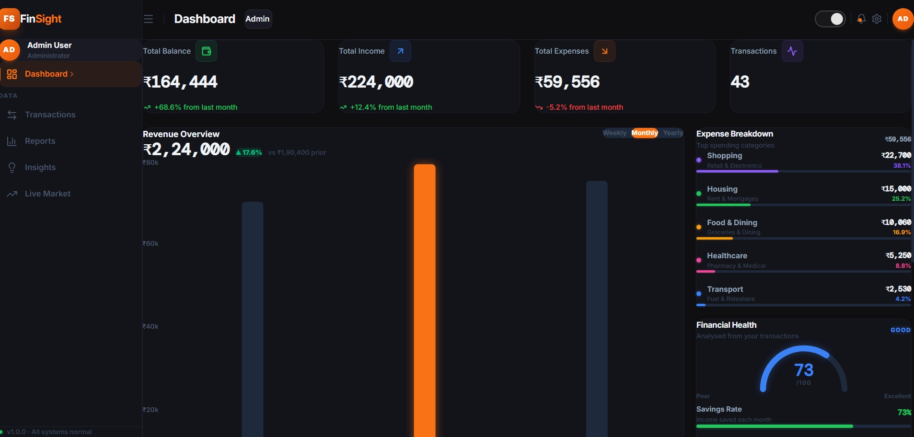
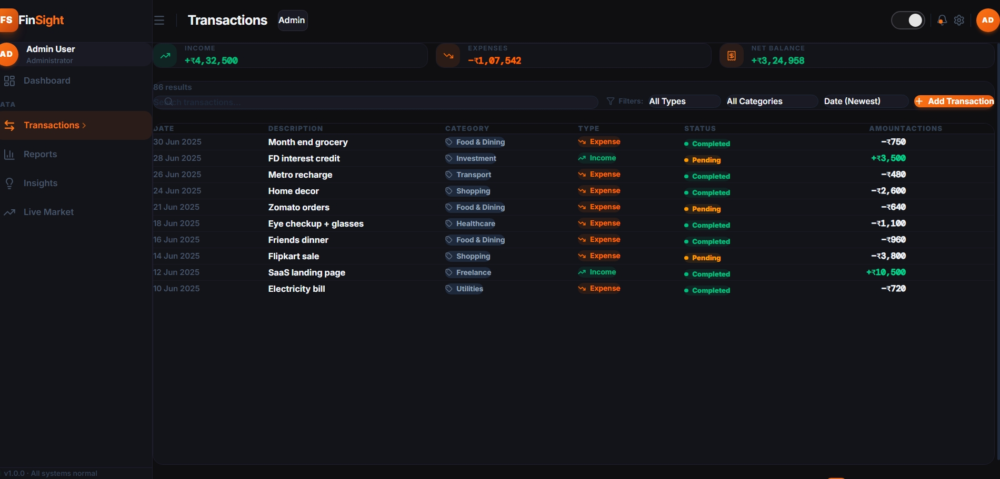
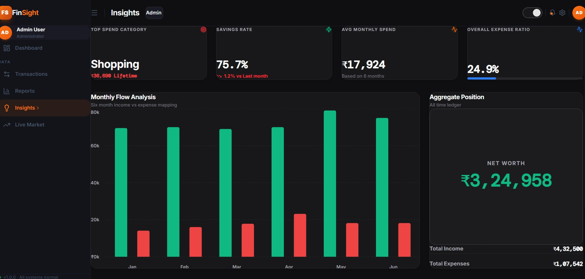
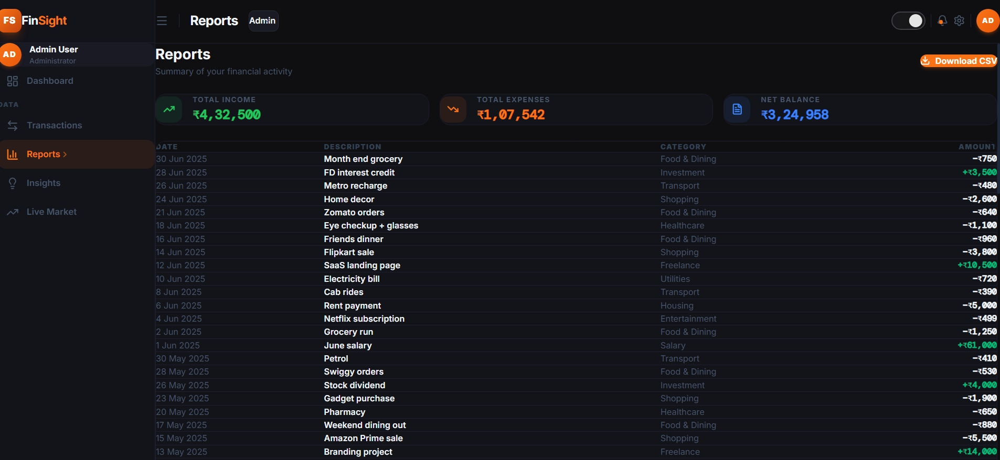
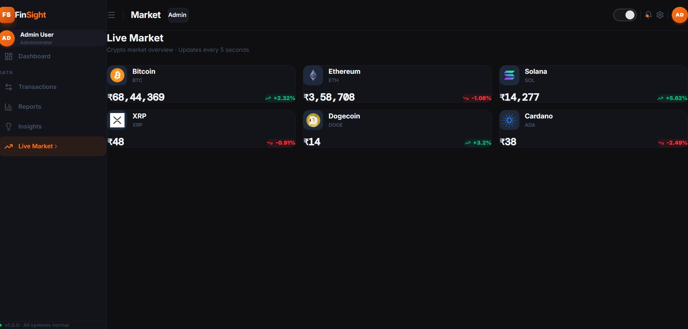

# FinSight

> A modern financial analytics dashboard built with React, TypeScript, Zustand, and Recharts for tracking transactions, surfacing spending patterns, and exploring portfolio-style insights through a polished responsive UI.

[](https://react.dev/)
[](https://www.typescriptlang.org/)
[](https://vite.dev/)
[](https://zustand-demo.pmnd.rs/)
[](https://tailwindcss.com/)

## Live Demo

Deployment URL:'https://finsight-dashboard-nqni.vercel.app/'

## Overview

FinSight is a frontend-first finance dashboard for exploring personal transaction data through analytics, reports, filters, and visual summaries. The application combines transaction management with interactive charts and responsive navigation to create a product-style experience rather than a static CRUD demo.

It was built to demonstrate how a modern React application can organize UI state, derived financial metrics, and multi-page dashboard flows inside a clean client-side architecture. The project solves the common problem of scattered financial data by presenting balances, trends, category breakdowns, transaction history, and report exports inside one cohesive interface.

## Key Features

- Interactive dashboard with summary cards for balance, income, expenses, and transaction volume
- Revenue overview chart with weekly, monthly, and yearly aggregation modes
- Net position trend visualization across recent months
- Expense breakdown analysis for top spending categories
- Financial health scoring based on savings rate and budget utilization
- Recent activity panel for quick transaction review
- Transaction management with create, edit, and delete flows
- Search, type, category, and sort controls for transaction discovery
- Paginated transaction table with mobile-friendly card layout
- Role-aware UI with `admin` and `viewer` modes
- Light and dark theme switching with persisted preference
- Insights page with savings rate, expense ratio, category ledger, and aggregate metrics
- Reports page with CSV export for the full transaction dataset
- Live market screen with simulated crypto price updates every 5 seconds
- Persisted client-side state using Zustand middleware and local storage
- Responsive sidebar and mobile drawer navigation

## Screenshots

> Add screenshots to a `screenshots/` directory to make this section render immediately on GitHub.












## Tech Stack

| Category | Technology |
| --- | --- |
| Framework | React 19 |
| Language | TypeScript |
| Build Tool | Vite 8 |
| Routing | React Router DOM 7 |
| State Management | Zustand + `persist` middleware |
| Styling | Tailwind CSS 4 |
| Charts | Recharts |
| Icons | Lucide React |
| Animated Metrics | react-countup |
| Data Source | Local mock dataset seeded in code |

## Architecture Overview

FinSight follows a straightforward frontend architecture optimized for clarity and iteration speed:

- `pages/` contains route-level screens such as Dashboard, Transactions, Insights, Reports, and Market.
- `components/` is organized by feature area, separating dashboard widgets, transaction UI, layout shell elements, and small reusable controls.
- `store/` centralizes app state in a single Zustand store for transactions, filters, theme, role, and dashboard time range.
- `data/` provides the seeded mock transaction dataset plus category and month constants used across the app.
- `utils/finance.ts` acts as the derived-data layer, converting raw transactions into summaries, health metrics, totals, formatted values, and chart-ready series.
- `types/` defines the shared TypeScript contracts for transactions, filters, summaries, roles, and themes.

The UI composition is route-driven: the app shell renders a persistent header and sidebar, then each page pulls from the shared store and finance utilities to compute the metrics and visualizations it needs.

## Folder Structure

```text
src/
|-- components/
|   |-- dashboard/
|   |-- insights/
|   |-- layout/
|   |-- transactions/
|   `-- ui/
|-- data/
|   `-- mockData.ts
|-- pages/
|   |-- Dashboard.tsx
|   |-- Insights.tsx
|   |-- Market.tsx
|   |-- Reports.tsx
|   `-- Transactions.tsx
|-- store/
|   `-- useStore.ts
|-- types/
|   `-- index.ts
|-- utils/
|   `-- finance.ts
|-- App.tsx
|-- index.css
`-- main.tsx
```

## Installation & Setup

```bash
git clone https://github.com/RuthvikJ/Finsight-dashboard.git
cd Finsight-dashboard
npm install
npm run dev
```

The app will start on the local Vite development server.

## Build for Production

```bash
npm run build
npm run preview
```

## Deployment

This project is well-suited for deployment on Vercel as a static frontend application. After pushing the repository to GitHub, import the project into Vercel and deploy it using the default Vite build settings.

- Build command: `npm run build`
- Output directory: `dist`

## Key Implementation Highlights

### Zustand State Management

The app uses a single persisted Zustand store to manage both data and UI concerns:

- Transaction records are initialized from a mock dataset and can be added, edited, or deleted.
- Theme and role preferences are persisted via local storage.
- Filters and dashboard time range are managed centrally for consistent behavior across screens.
- A dedicated filtered selector applies search, type, category, month, and sort rules client-side.

### Chart Rendering

Recharts powers the dashboard and insights experience:

- Revenue analytics use bar charts with switchable weekly, monthly, and yearly groupings.
- Trend analysis uses area charts for income and expense movement over time.
- Insights screens combine comparative bars, progress indicators, and category distribution visuals.
- Financial summaries are generated from reusable utility functions instead of page-local ad hoc calculations.

### Filtering System

Transaction exploration is entirely client-side and derived from store state:

- Text search matches against transaction description and category.
- Type and category filters narrow the active dataset immediately.
- Sorting supports both date and amount in ascending or descending order.
- The filtered collection also drives summary totals, pagination, and table rendering.

### Transaction CRUD Flow

Transaction management is implemented through a modal-based workflow:

- `admin` users can open the transaction modal from the filters toolbar.
- Existing rows can be edited inline from the transaction table.
- Deletions update the store instantly.
- The same dataset powers the dashboard, reports, and insights pages, so changes propagate across the application without refresh.

## Future Improvements

- Replace mock data with a real backend or serverless API
- Add authentication and permission enforcement beyond UI-level role switching
- Integrate live financial or crypto market APIs
- Introduce form validation and richer error handling
- Add unit and integration tests for store logic and chart transformations
- Support recurring transactions, budgets, and downloadable PDF reports

## License

This project is currently distributed without a license. Add a `LICENSE` file if you plan to make reuse explicit.

## Author

**Ruthvik J**

- GitHub: [github.com/RuthvikJ](https://github.com/RuthvikJ)
